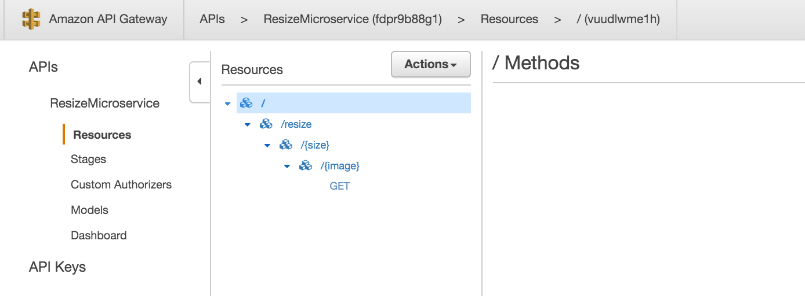

# serverless-image-resizer-service

A short tutorial on how to setup a serverless image resizing service on AWS.

In a few minutes, you too can have your very own fully scalable highly available, fault-tolerant, secure image resizing microservice.

At a glance:


## Get the code

Clone the repo:

```
git clone git@github.com:marksteele/serverless-image-resizer-service.git
```

## Create S3 buckets

For this example, we'll be using two buckets. One will contain source images, and the other resized images.

We'll call them 'img-sources', and 'img-resized' respectively.

## Enable static website hosting on resized bucket

Enable static website hosting on the 'img-resized' bucket, and take note of the URL endpoint. We'll need that later.

## Create an S3 bucket policy to allow lambda to talk to S3

For both buckets, head over to `permissions -> edit bucket policy` and paste the following:

```
{
	"Version": "2012-10-17",
	"Id": "Policy1460563093443",
	"Statement": [
		{
			"Sid": "Stmt1460563084735",
			"Effect": "Allow",
			"Principal": {
				"AWS": "*"
			},
			"Action": [
				"s3:GetObject",
				"s3:PutObject"
			],
			"Resource": "arn:aws:s3:::img-resized/*"
		}
	]
}
```

Adjust for the bucket (in the "Resource" section). This is probably too generous of a permission set, but I haven't yet had time to fine tune this. Caveat emptor.

## Edit resizer.js

Edit lines 13,14,15 to reflect your settings.

## Install and prepare lambda

In the folder you cloned this repo, do the following:

```
mkdir node_modules
npm install async gm --local
zip -r resizer *
```

## Setup a new lambda function

Login to AWS, and head on over to the lambda section. Click to create a new Lambda, and click 'skip' at the bottom to not select a preset blueprint.

Give it a name (eg: `resizer`) and description. The runtime should be Nodejs 4.3.

Select upload a .ZIP file from the radio buttons, click upload, and browse to the zipfile in the git checkout folder.

The handler name should be `resizer.handler`

The role should be the S3 execution role.

128MB of memory should be fine, and a timeout of 20 seconds should be more than enough.

I tested this in 'no VPC' mode. YMMV.

Click next, and create the function.

## Cloudfront #1

We're going to point a first instance of Cloudfront to point to our S3 'img-resized' bucket.

Head on over to cloudfront and create a new distribution.

Origin domain name is the 'img-resized' static website S3 bucket URL. Select other settings to something that makes sense. I customized the caching settings.

## API gateway

Create an API gateway API, call it ResizeMicroservice, or whatever your heart desires.

First, create a resource called `resize`. Then, create a sub-resource to `resize`, and call it size, and overwrite the path setting to `{size}`. Add a sub-resource to `{size}` called image, and once again overwrite the path to be `{image}`.

Finally on `{image}`, create a GET method. The GET method needs to invoke the Lambda function we created earlier.



Once that's done, we're going to do all the API gateway wiring that will allow our Lambda to return a redirect after creating images in S3.

### Method request

Click the `GET` method, click `Method Request`. Expand `Request Models`, add a content type `application/json`, and select `Empty` as the model. Save that. 

Click `<- Method execution` in the breadcrumbs to get back.

### Integration request

Click `Integration Request`, and expand `Body mapping template`.

Click `Add mapping template`, with a content type of `application/json`. Click the little checkmark, and an input box will appear. Paste this:

```
{ "size": "$input.params('size')", "image": "$input.params('image')" }
```

Click `Save`. Click `<- Method execution` in the breadcrumbs to get back.

### Method Response

In HTTP status, click the little X to remove the 200 entry. Create a new one with 302.

Highlight the 302, and click on `Add Header`, with a value of `Location`.

Click `<- Method execution` in the breadcrumbs to get back.

### Integration Response

Click `Integration Response`. Delete the 200 with the little X, and click `Add integration response`.

Select 302, Save. You should now be able to expand the 302.

Expand `Header Mappings`. Create an entry for `Location`, with a mapping value of `integration.response.body.location`. Save all that.

Once that's all done, click `Actions` and select `Deploy API`.

Deploy to a new stage called `prod`.

Note that `Invoke URL`, we'll need it later.

This is what the swagger definition for the API looks like:

```
{
  "swagger": "2.0",
  "info": {
    "version": "2016-04-14T02:04:13Z",
    "title": "ResizeMicroservice"
  },
  "host": "YOURURLHERE",
  "basePath": "/prod",
  "schemes": [
    "https"
  ],
  "paths": {
    "/resize/{size}/{image}": {
      "get": {
        "consumes": [
          "application/json"
        ],
        "parameters": [
          {
            "name": "size",
            "in": "path",
            "required": true,
            "type": "string"
          },
          {
            "name": "image",
            "in": "path",
            "required": true,
            "type": "string"
          },
          {
            "in": "body",
            "name": "Empty",
            "required": true,
            "schema": {
              "$ref": "#/definitions/Empty"
            }
          }
        ],
        "responses": {
          "302": {
            "description": "302 response",
            "headers": {
              "Location": {
                "type": "string"
              }
            }
          }
        },
        "x-amazon-apigateway-integration": {
          "responses": {
            "default": {
              "statusCode": "302",
              "responseParameters": {
                "method.response.header.Location": "integration.response.body.location"
              }
            }
          },
          "requestTemplates": {
            "application/json": "{ \"size\": \"$input.params('size')\", \"image\": \"$input.params('image')\" }"
          },
          "uri": "arn:aws:apigateway:us-east-1:lambda:path/2015-03-31/functions/arn:aws:lambda:us-east-1:150130051736:function:resize/invocations",
          "httpMethod": "POST",
          "type": "aws"
        }
      }
    }
  },
  "definitions": {
    "Empty": {
      "type": "object"
    }
  }
}
```

## Cloudfront #2

Now we're going to setup a second Cloudfront distribution which will point to our API gateway invocation URL.

Same drill as before, we only need specify the API gateway invocation hostname as origin domain.

Note the new cloudfront URL when you're done, we'll need it.


## S3 again...

Now we're going to configure the 'img-resized' bucket to redirect all 404 errors to the Cloudfront #2, which has the API gateway and Lambda as origin.

In the bucket properties, navigate to the static website hosting section and expand `Edit redirection rules`. Paste this:

```
<RoutingRules>
    <RoutingRule>
        <Condition>
            <HttpErrorCodeReturnedEquals>404</HttpErrorCodeReturnedEquals>
        </Condition>
        <Redirect>
            <HostName>YOURCLOUDFRONTHOSTNAMEGOESHERE</HostName>
            <ReplaceKeyPrefixWith>prod/resize/</ReplaceKeyPrefixWith>
            <HttpRedirectCode>302</HttpRedirectCode>
        </Redirect>
    </RoutingRule>
</RoutingRules>
```

Note that this should only be the hostname (eg: asdfasdfasdf.cloudfront.net).

# Finishing up

At this point, we're done. If our Cloudfront #1 domain is img1.cloudfront.net, and cloudfront #2 is img2.cloudfront.net, then hitting https://img1.cloudfront.net/100x100/someimage.jpg would:

* Check cloudfront #1 to see if it has a cached version of the image, if yes serve it. If no...
* Forward the request to S3. If S3 doesn't have it, it returns a 302 to redirect to cloudfront #2 at https://img2.cloudfront.net/prod/resize/100x100/someimage.jpg
* Cloudfront #2 checks to see if it has a cached response, if yes serve it. If no...
* Hit API gateway, which invokes lambda, which creates file in S3 and returns 302 redirect (which then is cached in cloudfront #2)

During the initial warm-up period, cloudfront will have cached 302 redirect responses (for up to an hour so I'm told), after which everything will go through Cloudfront #1. This should effectively limit calls to API gateway to a single time when generating previously un-resized images.


